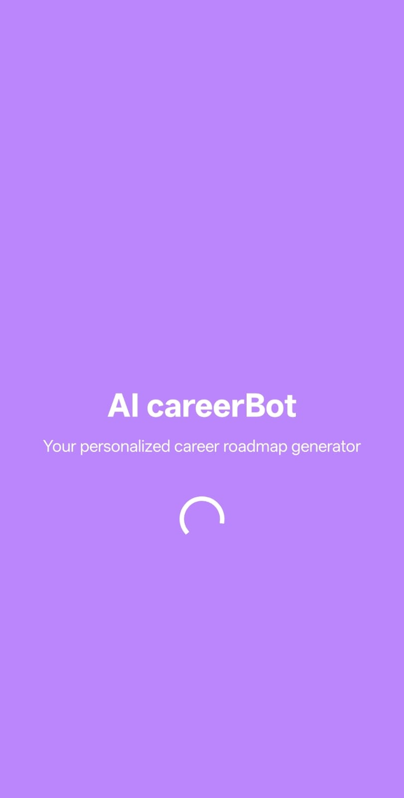
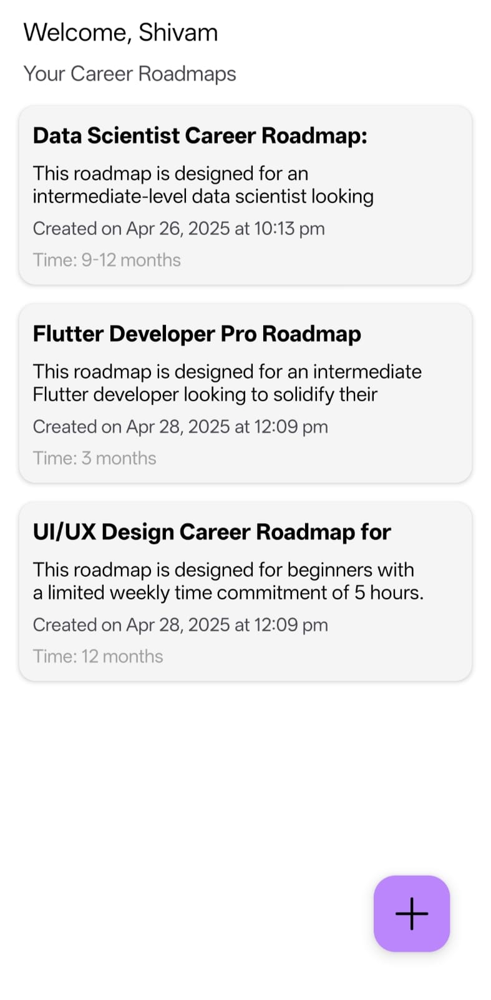
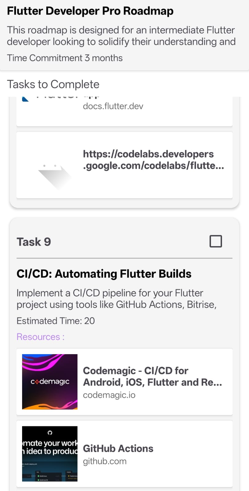

# CareerBot – AI-Powered Career Roadmap Generator 🚀

CareerBot is an intelligent Android application that helps users generate personalized career roadmaps based on their goals, experience, and weekly availability. Powered by Google's Gemini Flash 2.0 model, the app generates actionable learning tasks with curated resources including videos, blogs, and documentation – all stored locally and trackable in a clean interface.

> 🧠 Built using Kotlin + XML in Android Studio with seamless integration of AI, Room database, and Retrofit.

---

## ✨ Features

- 💬 AI-powered roadmap generation based on user input
- 📅 Personalized learning plans with tasks and resources
- ✅ Task progress tracking (mark tasks as completed)
- 🔗 Embedded links with real-time previews (YouTube, blogs, docs)
- 🗃️ Room Database for offline storage and task persistence
- ♻️ Add or delete roadmaps easily
- 🧾 Lightweight, smooth, and user-friendly UI

---

## 📸 Screenshots

> Swipe to view the app UI

<p align="center" style="overflow-x: auto;">
  
  
  
  
  
</p>

---

## 🔧 Installation

1. **Clone this repository**
   ```bash
   git clone https://github.com/shivamtechstack/AI-Powered-Career-Roadmap-Generator.git
Open in Android Studio

Add your Gemini API Key

Go to AddNewRoadmapActivity

Replace: 
const val apiKey = "your_api_key_here"
Build and Run the app on an emulator or Android device (API 29+)

🧰 Tech Stack
📱 Android – Kotlin + XML

🔗 Retrofit – For API communication

🧠 Gemini Flash 2.0 – Google Generative AI

🗃️ Room DB – Local storage of roadmaps and tasks

🖼️ Link Preview Library – Rich previews of shared links

🧩 MVVM Pattern – Modular and scalable architecture

🤝 Contributing
Pull requests and contributions are welcome.
Please fork the repository and submit a PR with clear explanation and minimal changes.

📬 Contact
Developer: Shivam
📧 Personal: shivam16yadav16@gmail.com
📧 Dev: devshivamyadav1604@gmail.com
🔗 GitHub: @shivamtechstack

📄 License
This project is licensed under the MIT License.